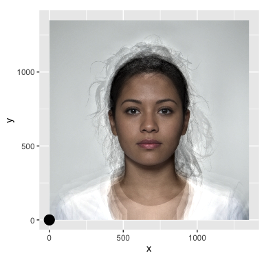

``` r
knitr::opts_chunk$set(
  fig.path = "man/figures/README-",
  out.width = "100%",
  fig.width = 4, 
  fig.height = 4
)
```

``` r
library(ggplot2)
```

## Img itself is fine

``` r
path <- system.file("f_multi.jpg", package = "imginv")
img <- magick::image_read(path)
img
```


``` r
i <- grid::rasterGrob(img, interpolate = FALSE)
width <- 1350
height <- 1350
d <- data.frame(x = 0, y = 0)
```

## Inverted (in vignette)

``` r
ggplot() +
  scale_y_reverse() +
  coord_fixed(xlim = c(0, width),
              ylim = c(0, height)) +
  annotation_custom(i, 0, width, -height, 0) +
  geom_point(data = d, aes(x, y), size = 5)
```


## Upright

``` r
ggplot() +
  #scale_y_reverse() +
  coord_fixed(xlim = c(0, width),
              ylim = c(0, height)) +
  annotation_custom(i, 0, width, height, 0) +
  geom_point(data = d, aes(x, y), size = 5)
```


